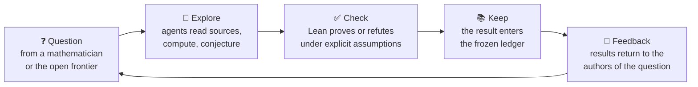

# The Omega Institute

**An open math model that grows by adding checked truth, not by training weights.**

[](https://github.com/the-omega-institute/trureturing-film)

Open models usually publish weights. We publish mathematics.
**[trureturing](https://github.com/the-omega-institute/trureturing)** is an open math
model whose entire state is a Lean 4 library: questions, computations, proofs,
refutations and open boundaries, each with its sources and exact assumptions.
The model improves only when a new result passes the Lean kernel and enters the
ledger. Everything it knows can be read, checked, cited and built on.

**[Explore the atlas](https://the-omega-institute.github.io/trureturing-pages/atlas.html)** ·
[Read the book](https://the-omega-institute.github.io/trureturing-mdbook/) ·
[How the loop works](https://the-omega-institute.github.io/trureturing-pages/open-math.html?lang=en) ·
[Vision](https://github.com/the-omega-institute/trureturing/blob/dev/docs/VISION.md) ·
[Watch the films](https://github.com/the-omega-institute/trureturing-film)

## The loop



Mathematicians bring intuition, judgment and the questions that matter to them.
Agents read the literature, run experiments and draft arguments. Lean decides what
is proved. Each checked result goes back to the people who asked, and their reply
sets the next target: a refuted conjecture sharpens the question, a settled case
exposes the general one. Since September 2026 this loop has been running with
working mathematicians; the research news below shows where it has led.

## Research news

- **Sep 2026 · Poster accepted at NeurIPS 2026 MATH-AI.**
  *Cross-Engine Admission Contracts for Autonomous Formalization* (H. Ma, W. Zhang)
  audits what a mathematical-agent pipeline should require before a formal result is
  admitted: independent kernel replay, allowed dependencies, and comparison with a
  trusted statement.
  We look forward to presenting it at the
  [MATH-AI workshop](https://mathai-2026.github.io/) in Atlanta on 12 December 2026,
  whose theme is how agents can be reliable collaborators for human mathematicians.
  [OpenReview](https://openreview.net/forum?id=xOAZvprLXO)
- **Sep 2026 · Joint work with Reza Nikandish on binary subspace orthogonality graphs.**
  The clique formula for all-dimensional subspaces answers his Problem 4.2, and a new
  15-coloring of all 2,824 subspaces of `F_2^6` shows `χ(O_6*) = 15`, confirmed by an
  independent checker and a kernel-checked Lean theorem. A joint manuscript is in
  preparation. [Workspace](https://github.com/the-omega-institute/binary-subspace-orthogonality)
- **Sep 2026 · With Rafik Sahbi: sub-quorum colorings of hypercubes, settled.**
  *Sub-quorum colorings of graphs* (H. Ma, R. Sahbi, W. Zhang,
  [arXiv:2609.25128](https://arxiv.org/abs/2609.25128)) proves Sahbi's Conjecture 6.4:
  the sub-quorum coloring number of `Q_n` is `2^(n-1)` for every `n ≥ 2`, with a
  dimension-independent Lean proof. Rectangular grids are next.
  [Results and certificates](https://github.com/the-omega-institute/subquorum-colorings)
- **Sep 2026 · With Benoît Cloitre: OEIS A076502 described by a Padovan automaton.**
  *A Padovan-automatic description of a nested recurrence* (B. Cloitre, H. Ma, W. Zhang,
  [arXiv:2609.33421](https://arxiv.org/abs/2609.33421)) proves the exact floor-offset
  set `{-1, 0, 1, 2}`, a 26-letter morphic presentation and least balance constant 4.
  Cloitre's independently written verifier replays the certificates.
  [Reproducibility package](https://github.com/the-omega-institute/a076502-padovan)
- **Sep 2026 · Nested recurrences with John M. Campbell and Benoît Cloitre.**
  Campbell's recurrence now has a complete formula, and its ratio oscillates between
  2/5 and 3/4. For Cloitre's recurrence the golden lower bound and Fibonacci structure
  are proved; the full golden-ratio limit is still open.
  [Collaboration](https://github.com/the-omega-institute/nested-recurrences)
- **Sep 2026 · With Manuel Israel Cázares: a certificate-producing solver for SAIR EQT2.**
  *A Certificate-Producing Cascade for Equational Implication* (H. Ma, W. Zhang,
  M. I. Cázares, [arXiv:2609.00706](https://arxiv.org/abs/2609.00706)).
  [Solver](https://github.com/the-omega-institute/sair-eqt2-stage2-solver)
- **2026 · Published in RAIRO – Theoretical Informatics and Applications.**
  *Canonical Zeckendorf Normalization and sharp iteration depth of the Berstel Adder*
  (H. Ma, W. Zhang), RAIRO-ITA 60 (2026) 29.
  [doi:10.1051/ita/2026032](https://www.rairo-ita.org/articles/ita/abs/2026/01/ita20260032/ita20260032.html)
- **Jul 2026 · Where language models fail on Lean-verified algebra.**
  *Mechanism-level routing failure in LLMs over Lean-verified algebraic structures*
  (M. I. Cázares, W. Zhang, H. Ma, [arXiv:2607.04534](https://arxiv.org/abs/2607.04534)).

## Open right now

Each of these came out of a collaboration above. The settled cases are checked;
the general question is waiting for a new idea.

- **Does Cloitre's sequence approach the golden ratio?** Is `C(n)/n → (√5 − 1)/2`
  over all integers, including the interiors of the Fibonacci blocks?
  [Results and open questions](https://github.com/the-omega-institute/nested-recurrences/blob/main/STATUS.md)
- **What is `χ(O_n*)` for `n ≥ 7`?** Dimension six is now settled at 15;
  Nikandish's Problem 4.3 remains open for `n ≥ 7`.
  [Dimension six](https://github.com/the-omega-institute/binary-subspace-orthogonality/blob/main/notes/dimension-six.md)
- **Does Sahbi's grid formula hold at every width and length?** A uniform
  dissociation formula and exact strip certificates are in hand; the full grid
  conjecture is open.
  [Research agenda](https://github.com/the-omega-institute/subquorum-colorings/blob/main/docs/RESEARCH.md)
- **537 more problems from the literature**, from OEIS, Erdős problems and recent
  papers, each with its sources and current status.
  [Browse the atlas](https://the-omega-institute.github.io/trureturing-pages/atlas.html)

## By the numbers

*Measured on `trureturing@dev` (`e8e43c4`), 2026-10-03.*

| | |
|---|---|
| **5,752** | Lean modules in the frozen ledger |
| **32,000+** | theorem declarations in the Lean source |
| **537** | problems from the literature, each with sources |
| **100+** | conjectures and claims from the literature refuted in Lean |

## More results from the library

- **Greathouse's formula for OEIS A175406, refuted.** At `n = 1121626023352383` the
  conjectured `floor((n + 1/2) log 2)` exceeds the true value by one; the Lean proof uses
  certified logarithm bounds.
  [Problem](https://the-omega-institute.github.io/trureturing-mdbook/Problems/oeis-a175406-log-two-floor-refutation.html)
- **A blind spot of local observation.** A Bell state and the classical mixture of `00`
  and `11` have identical single-qubit marginals; the correlation sector omitted by local
  descriptions has real dimension `(m² − 1)(n² − 1)`.
  [Lean](https://github.com/the-omega-institute/trureturing/blob/dev/D5/S3/Quantum/Entanglement/LocalMarginalCorrelationBlindSpot.lean)
- **Golden-ratio coordinates of Zeckendorf digits.** The deficit
  `β(a) + β(b) − β(a + b)` takes values only in `{−1, 0, 1}` for all natural inputs.
  [Lean](https://github.com/the-omega-institute/trureturing/blob/dev/D5/S1/Deficit/DeficitThreeValued.lean)

## Bring a question

Have a conjecture you would like checked, extended or refuted? Open an issue on
[trureturing](https://github.com/the-omega-institute/trureturing/issues), or explore
on your own. In Claude Code or Codex, paste:

```text
Help me explore https://github.com/the-omega-institute/trureturing: use an existing checkout or clone it into a new directory if needed, read AGENTS.md and README.md, then read the relevant SKILL.md under skills/ to investigate a question I care about and find a checked result or a clearly stated open question.
```

The [contribution guide](https://github.com/the-omega-institute/trureturing/blob/dev/docs/CONTRIBUTING.md)
covers forks, checks and pull requests. Contributions in English and Chinese are welcome.

## Part of [Chrono AI](https://www.chrono-ai.fun/)
